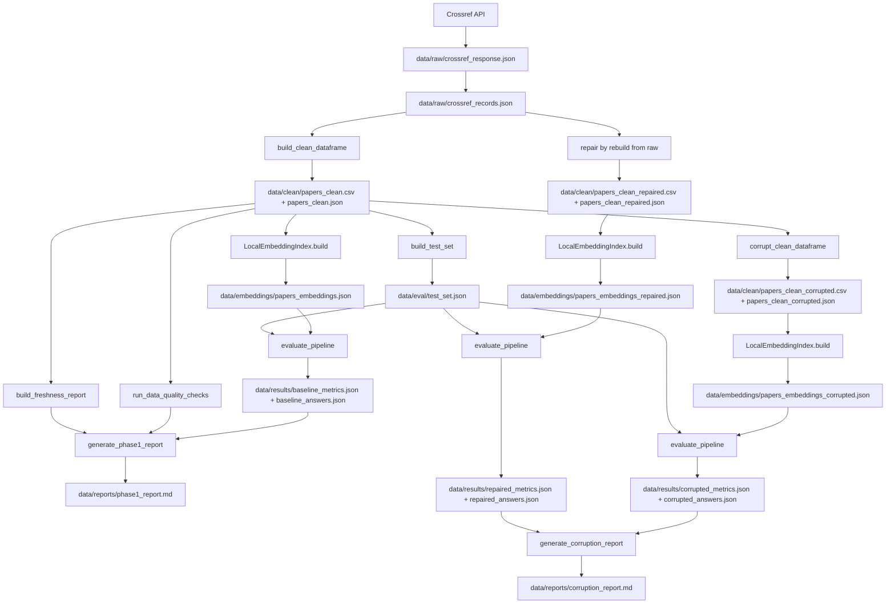

# Pipeline Handoff

This document is the orchestration map for Role 1 (pipeline coordination, release, and demo).
It connects the implementation in `src/core/` and `src/pipelines/` to the concrete artifacts under `data/`.

## 1. Ownership, branch, and done criteria

Current shared branch observed on 2026-08-06: `main`

Recommended working split:

| Scope | Primary ownership | Main files | Recommended branch | Done when |
| --- | --- | --- | --- | --- |
| Config and artifact paths | Pipeline coordinator | `src/core/config.py` | `feat/pipeline-config` | All paths resolve and `.env` keys map to supported providers |
| Baseline orchestration | Pipeline coordinator | `src/pipelines/phase1.py` | `feat/pipeline-phase1` | Raw -> clean -> index -> evaluate -> report runs end-to-end |
| Corruption and repair orchestration | Pipeline coordinator | `src/pipelines/corruption_flow.py` | `feat/pipeline-corruption` | Corrupted and repaired runs both produce comparable metrics and reports |
| Release and demo entrypoints | Pipeline coordinator | `script/run_phase1.py`, `script/run_corruption_flow.py` | `feat/pipeline-demo` | Demo commands run from a clean environment with documented outputs |

Definition of done for the full milestone:

1. `script/run_phase1.py` produces baseline artifacts without manual file edits.
2. `script/run_corruption_flow.py` produces corrupted and repaired artifacts from the same baseline/test set.
3. Metrics are written for baseline, corrupted, and repaired states.
4. Quality and freshness outputs exist for each relevant state.
5. Markdown reports are present for the baseline and the comparison flow.

## 2. Local environment checklist

Repository constraints from code:

- Python: `>=3.11,<3.14` from `pyproject.toml`
- Settings loader: `src/core/config.py`
- Default provider keys: `.env.example`
- Entrypoints: `script/run_phase1.py`, `script/run_corruption_flow.py`

Recommended verification commands:

```powershell
python --version
python -m pip install -e .
python script/run_phase1.py
python script/run_corruption_flow.py
```

Provider note:

- `LLM_PROVIDER` supports `gemini`, `openai`, `anthropic`, `openrouter`, `ollama`, and `custom`.
- Credential validation happens through `require_llm_credentials()` in `src/core/config.py`.

## 3. Artifact contract

The pipeline currently writes to these canonical paths:

| Stage | Primary artifact(s) |
| --- | --- |
| Raw ingest | `data/raw/crossref_response.json`, `data/raw/crossref_records.json` |
| Clean baseline | `data/clean/papers_clean.csv`, `data/clean/papers_clean.json` |
| Raw to clean validation | `data/quality/raw_to_clean_validation_sample.json` |
| Baseline index | `data/embeddings/papers_embeddings.json`, `data/embeddings/retrieval_smoke_checks.json` |
| Evaluation set | `data/eval/test_set.json` |
| Baseline results | `data/results/baseline_metrics.json`, `data/results/baseline_answers.json` |
| Baseline observability | `data/quality/baseline_quality.json`, `data/quality/freshness_report.json`, `data/reports/phase1_report.md` |
| Corrupted clean set | `data/clean/papers_clean_corrupted.csv`, `data/clean/papers_clean_corrupted.json` |
| Corrupted results | `data/results/corrupted_metrics.json`, `data/results/corrupted_answers.json`, `data/results/corruption_log.json` |
| Corrupted observability | `data/quality/corrupted_quality.json`, `data/quality/freshness_report_corrupted.json` |
| Repaired clean set | `data/clean/papers_clean_repaired.csv`, `data/clean/papers_clean_repaired.json` |
| Repaired results | `data/results/repaired_metrics.json`, `data/results/repaired_answers.json` |
| Repaired observability | `data/quality/repaired_quality.json`, `data/quality/freshness_report_repaired.json`, `data/reports/corruption_report.md` |

## 4. Handoff diagram



## 5. Module-to-stage map

| Stage | Module |
| --- | --- |
| Source fetch and raw snapshots | `src/ingestion/crossref.py` |
| Cleaning and schema normalization | `src/ingestion/cleaning.py` |
| Intentional corruption | `src/ingestion/corruption.py` |
| Embeddings and local index build | `src/retrieval/index.py` |
| Test set creation | `src/evaluation/testset.py` |
| Pipeline evaluation | `src/evaluation/metrics.py` |
| Quality and freshness checks | `src/observability/quality.py` |
| Markdown reporting | `src/observability/reporting.py` |
| Baseline orchestration | `src/pipelines/phase1.py` |
| Corruption and repair orchestration | `src/pipelines/corruption_flow.py` |

## 6. Role 2 - Data platform and recovery

Delivery status in code:

- Stable `paper_id`: DOI first, hashed fallback from title + first author + date + URL in `src/ingestion/crossref.py`
- Raw snapshot before parse: `data/raw/crossref_response.json`
- Parsed snapshot after contract mapping: `data/raw/crossref_records.json`
- Retry/backoff for `429` and `503`: implemented in `fetch_source_records()`
- Clean schema rules:
  - null rule: drop rows missing `paper_id`, `title`, or `summary`
  - date rule: normalize to `YYYY-MM-DD`
  - duplicate rule: keep first unique `paper_id`
  - authors/categories rule: normalize whitespace, fallback to `Unknown Author` and `Uncategorized`
- `text_for_embedding`: `Title + Authors + Categories + Published + Summary`
- `age_days`: `run_date - published`
- CP1 validation sample: `data/quality/raw_to_clean_validation_sample.json`

## 7. Role 3 - RAG and agent

Delivery status in code:

- Embedding model: `sentence-transformers/all-MiniLM-L6-v2`
- Vector store: persistent Chroma in `data/chroma/`
- Collection names:
  - baseline: `papers-baseline`
  - corrupted: `papers-corrupted`
  - repaired: `papers-repaired`
- Minimum metadata:
  - `paper_id`
  - `title`
  - `published`
  - `authors_joined`
  - `categories_joined`
  - `summary`
  - `abs_url`
  - `pdf_url`
- Smoke checks artifact: `data/embeddings/retrieval_smoke_checks.json`
- Built-in retrieval interfaces:
  - semantic search: `LocalEmbeddingIndex.search()`
  - exact lookup: `LocalEmbeddingIndex.lookup()`
  - agent tools: `semantic_search_papers`, `lookup_paper`

## 8. Role 4 - Evaluation and observability

Delivery status in code:

- Test set question families:
  - summary
  - authors
  - published date
  - categories
- `ground_truth_doc_ids` always comes from clean `paper_id`
- Baseline artifacts required:
  - `data/eval/test_set.json`
  - `data/results/baseline_metrics.json`
  - `data/results/baseline_answers.json`
  - `data/quality/baseline_quality.json`
  - `data/quality/freshness_report.json`
  - `data/reports/phase1_report.md`
- Corruption flow artifacts required:
  - `data/results/corrupted_metrics.json`
  - `data/results/corrupted_answers.json`
  - `data/results/repaired_metrics.json`
  - `data/results/repaired_answers.json`
  - `data/results/corruption_log.json`
  - `data/quality/corrupted_quality.json`
  - `data/quality/repaired_quality.json`
  - `data/quality/freshness_report_corrupted.json`
  - `data/quality/freshness_report_repaired.json`
  - `data/reports/corruption_report.md`
- Quality and freshness signals:
  - row count
  - null counts on primary fields
  - duplicate `paper_id` count
  - average summary length
  - `age_days`
  - stale row count
  - latest and oldest source update timestamp
- Report proof points:
  - metric deltas baseline vs corrupted
  - recovery deltas repaired vs corrupted
  - example failed answers from corrupted data
  - example recovered answers after repair
